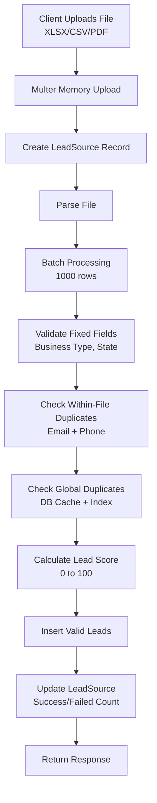

```markdown
# RWS Admin Backend

This is the backend server for the RWS Admin application, built with **Node.js**, **Express**, and **MongoDB**. It provides a RESTful API for **user management**, **authentication**, and **lead processing** with dynamic file upload, global deduplication, and **lead scoring**.

---

## Running the Server

1. Install dependencies:
   ```bash
   npm install
   ```
2. Create a `.env` file from the `.env.example` template.

To start the server in development mode with automatic reloading, run:

```bash
npm run dev
```

The server will be running on the port specified in your `.env` file (e.g., `http://localhost:5000`).

---

## API Endpoints

This API uses `httpOnly` cookies for authentication. To test the protected endpoints with `curl`, you need to save the cookie from the login response and send it with subsequent requests.

### Authentication

#### 1. Create a New User

*   `POST /api/users/signup`

```bash
curl -X POST http://localhost:5000/api/users/signup \
-H "Content-Type: application/json" \
-d '{
  "name": "Jane Doe",
  "email": "jane.doe@example.com",
  "password": "password123",
  "contactNumber": "1234567890",
  "gender": "Female"
}'
```

#### 2. Log In a User (Login)

*   `POST /api/users/login`

This command saves the authentication cookie to a file named `cookies.txt`.

```bash
curl -X POST http://localhost:5000/api/users/login \
-H "Content-Type: application/json" \
-c cookies.txt \
-d '{
  "email": "jane.doe@example.com",
  "password": "password123"
}'
```

#### 3. Log Out a User

*   `GET /api/users/logout`

```bash
curl -X GET http://localhost:5000/api/users/logout -b cookies.txt
```

---

### User Management (Protected)

The following endpoints require the authentication cookie (`cookies.txt`) to be sent with the request using the `-b` flag.

#### 4. Get Current User's Profile

*   `GET /api/users/me`

```bash
curl -X GET http://localhost:5000/api/users/me -b cookies.txt
```

#### 5. Get All Users

*   `GET /api/users/get`

```bash
curl -X GET http://localhost:5000/api/users/get -b cookies.txt
```

#### 6. Get a Single User by ID

*   `GET /api/users/get/:id`

Replace `<USER_ID>` with an actual user ID.

```bash
curl -X GET http://localhost:5000/api/users/get/<USER_ID> -b cookies.txt
```

#### 7. Update a User (Admin only)

*   `PUT /api/users/update/:id`

Replace `<USER_ID>` with an actual user ID.

```bash
curl -X PUT http://localhost:5000/api/users/update/<USER_ID> \
-H "Content-Type: application/json" \
-b cookies.txt \
-d '{
  "name": "Jane Smith"
}'
```

**Postman Collection (Import Ready)**

```json
{
  "info": {
    "name": "RWS Admin - Users API",
    "schema": "https://schema.getpostman.com/json/collection/v2.1.0/collection.json"
  },
  "item": [
    {
      "name": "Signup",
      "request": {
        "method": "POST",
        "header": [{ "key": "Content-Type", "value": "application/json" }],
        "body": {
          "mode": "raw",
          "raw": "{\n  \"name\": \"John Doe\",\n  \"email\": \"john@example.com\",\n  \"password\": \"password123\",\n  \"contactNumber\": \"1234567890\",\n  \"gender\": \"Male\"\n}"
        },
        "url": "{{baseUrl}}/api/users/signup"
      }
    },
    {
      "name": "Login",
      "request": {
        "method": "POST",
        "header": [{ "key": "Content-Type", "value": "application/json" }],
        "body": {
          "mode": "raw",
          "raw": "{\n  \"email\": \"john@example.com\",\n  \"password\": \"password123\"\n}"
        },
        "url": "{{baseUrl}}/api/users/login"
      }
    },
    {
      "name": "Get My Profile",
      "request": {
        "method": "GET",
        "header": [{ "key": "Cookie", "value": "connect.sid={{session}}" }],
        "url": "{{baseUrl}}/api/users/me"
      }
    },
    {
      "σιμο": "Get All Users",
      "request": {
        "method": "GET",
        "header": [{ "key": "Cookie", "value": "connect.sid={{session}}" }],
        "url": "{{baseUrl}}/api/users/get"
      }
    },
    {
      "name": "Get User by ID",
      "request": {
        "method": "GET",
        "header": [{ "key": "Cookie", "value": "connect.sid={{session}}" }],
        "url": "{{baseUrl}}/api/users/get/:userId",
        "variable": [{ "key": "userId", "value": "60d5ec49f1b2c3a4e8f1a2b3" }]
      }
    },
    {
      "name": "Update User",
      "request": {
        "method": "PUT",
        "header": [
          { "key": "Content-Type", "value": "application/json" },
          { "key": "Cookie", "value": "connect.sid={{session}}" }
        ],
        "body": {
          "mode": "raw",
          "raw": "{\n  \"name\": \"John Smith\"\n}"
        },
        "url": "{{baseUrl}}/api/users/update/:userId",
        "variable": [{ "key": "userId", "value": "60d5ec49f1b2c3a4e8f1a2b3" }]
      }
    },
    {
      "name": "Logout",
      "request": {
        "method": "GET",
        "header": [{ "key": "Cookie", "value": "connect.sid={{session}}" }],
        "url": "{{baseUrl}}/api/users/logout"
      }
    }
  ],
  "variable": [
    { "key": "baseUrl", "value": "http://localhost:5000" },
    { "key": "session", "value": "your_session_cookie_here" }
  ]
}
```

---

### Lead Management (Protected)

#### 8. Upload Leads File

*   `POST /api/leads/upload` to `leadsFile` (XLSX/CSV/PDF)

```bash
curl -X POST http://localhost:5000/api/leads/upload \
  -H "Cookie: $(cat cookies.txt | grep connect.sid | cut -f7)" \
  -F "leadsFile=@./sample-leads.xlsx"
```

#### 9. Get All Upload History

*   `GET /api/leads/sources`

```bash
curl -X GET http://localhost:5000/api/leads/sources -b cookies.txt
```

#### 10. Get Leads by Source ID

*   `GET /api/leads/sources/:sourceId`

Replace `<SOURCE_ID>` with actual ID.

```bash
curl -X GET http://localhost:5000/api/leads/sources/<SOURCE_ID> -b cookies.txt
```

**Postman Collection (Import Ready)**

```json
{
  "info": {
    "name": "RWS Admin - Leads API",
    "schema": "https://schema.getpostman.com/json/collection/v2.1.0/collection.json"
  },
  "item": [
    {
      "name": "Upload Leads File",
      "request": {
        "method": "POST",
        "header": [{ "key": "Cookie", "value": "connect.sid={{session}}" }],
        "body": {
          "mode": "formdata",
          "formdata": [
            { "key": "leadsFile", "type": "file", "src": "leads.xlsx" }
          ]
        },
        "url": "{{baseUrl}}/api/leads/upload"
      }
    },
    {
      "name": "Get All Uploads",
      "request": {
        "method": "GET",
        "header": [{ "key": "Cookie", "value": "connect.sid={{session}}" }],
        "url": "{{baseUrl}}/api/leads/sources"
      }
    },
    {
      "name": "Get Leads by Source",
      "request": {
        "method": "GET",
        "header": [{ "key": "Cookie", "value": "connect.sid={{session}}" }],
        "url": "{{baseUrl}}/api/leads/sources/:sourceId",
        "variable": [{ "key": "sourceId", "value": "60d5ec49f1b2c3a4e8f1a2b3" }]
      }
    }
  ],
  "variable": [
    { "key": "baseUrl", "value": "http://localhost:5000" },
    { "key": "session", "value": "your_session_cookie_here" }
  ]
}
```

---

## Lead Processing Flow (Diagram)



---

## Lead Scoring Algorithm (0 to 100)

| Rule | Points |
|------|--------|
| Business Type = Restaurant/Hotel/Clinic | +30 |
| Business Type = Retail/Cafe | +20 |
| State = CA/NY/TX | +25 |
| Has Email | +15 |
| Has Phone | +10 |
| Has Website | +10 |
| Has Facebook | +5 |

> Edit rules in `utils/leadScorer.js`

---

## Folder Structure

```
.
├───auth
│   └───jwtToken.js
├───controllers
│   ├───leadController.js
│   └───userController.js
├───db
│   └───connectDB.js
├───middlewares
│   ├───authenticate.js
│   ├───authorize.js
│   ├───leadValidation.js
│   ├───upload.js
│   └───userValidation.js
├───models
│   ├───leadModel.js
│   ├───leadSourceModel.js
│   └───userModel.js
├───routes
│   ├───leadRoutes.js
│   └───userRoutes.js
├───utils
│   ├───batchProcessor.test.js
│   ├───leadScorer.js
│   └───processLeadBatch.js
├───.env
├───.gitignore
├───jest.config.js
├───package-lock.json
├───package.json
├───README.md
└───server.js
```

---

## Testing

```bash
npm test
```

Covers:
- Batch processing
- Validation
- Global deduplication
- Lead scoring

---

**Fast. Secure. Dynamic. Scored.**
```
```
